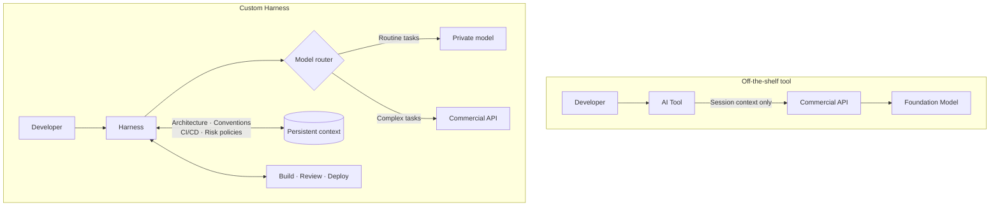
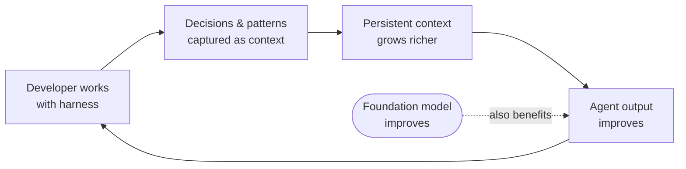
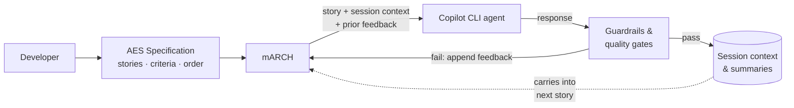

In high-frequency trading, the firms that win are not the ones with the best algorithm alone. They are the ones who figured out that the algorithm is only part of the equation, and that the rest is infrastructure. Co-location means placing your trading servers physically inside or adjacent to an exchange's data center. The shorter the cable between your server and the exchange's matching engine, the faster your orders arrive, and in high-frequency trading, faster by microseconds is faster enough to matter. Firms have spent millions on this. Some have strung microwave towers in straight lines between Chicago and New York to shave a few milliseconds off the path that light takes through fiber. Others have invested in custom field-programmable gate arrays to execute trading logic in hardware rather than software, cutting latency by another order of magnitude. The competitive edge in each case is marginal in absolute terms and enormous in competitive ones.

The stratification that followed is what makes the co-location story worth sitting with. Retail investors and institutional investors now operate in meaningfully different environments. Both participate in the same markets, but one group does so with tools and infrastructure that the other group cannot practically replicate. The gap is not about access to information. It is about how many nanoseconds separate intention from execution.

I have been watching something similar form in how large organizations are beginning to approach AI tooling for software development.

## The commodity layer

Most teams today use off-the-shelf AI development tools. GitHub Copilot, Claude Code, Cursor, all of them genuinely useful and getting more capable with each generation of underlying models. For the vast majority of developers working on the vast majority of codebases, they represent a real and measurable improvement in how quickly code can be written, reviewed, and refactored. They work well because they are designed to work for everyone: the tools are generic by construction, they operate on the assumption that they know nothing specific about your stack, your conventions, your architecture decisions, or your deployment model, and they produce results that are good enough for a remarkably broad range of contexts.

That generality is also the ceiling. A generic tool cannot have deep knowledge of how your organization handles database migrations, what your senior engineers mean when they say "follow the pattern from the auth service," or what your release process looks like in enough detail to plan around it. The tool gets the surrounding files as context, and it uses them well, but there is a layer of organizational knowledge that lives outside of files, in conventions, in history, in decisions that were made years ago and are now just how things are done, that generic tooling has no way to access.

## What big tech is already building

Google, Meta, and Amazon have all moved past asking whether they should use AI tools for software development. They are now building their own.

Google has mandated that engineers use internally developed tools based on Gemini, rather than third-party alternatives. The platform they are building, called Antigravity, goes beyond autocomplete or inline suggestion. It operates as an agentic system: engineers delegate high-level goals, and the agent plans, executes, and verifies multi-step tasks autonomously, touching code, terminals, and browsers without a human directing each step. The output is an artifact for the engineer to review, not a suggestion to accept or reject line by line.

Meta acquired Manus AI for two billion dollars and is building a model internally called Avocado, focused on autonomous multi-step agent workflows. Their internal tool, Metamate, was already running on a combination of their own Llama models and external APIs. The direction of travel is toward more proprietary models and less external dependency.

Amazon has built AgentCore, an infrastructure layer for orchestrating agentic workflows within AWS, and Kiro, an agent-native integrated development environment. Both are designed so that organizations can run agents that integrate directly with internal build systems, deployment pipelines, and organizational infrastructure, rather than agents that operate through a generic code editing interface.

Goldman Sachs took a different approach but arrived at a similar place. Rather than deploying a generic coding assistant, they piloted Devin, a specialized autonomous coding agent from Cognition Labs, and scaled to hundreds of instances internally by mid-2025, with plans to reach thousands. Every line Devin produces is reviewed by a human engineer before it merges, because the regulatory environment in financial services leaves no room for a different arrangement. The decision reflects something more specific than just AI adoption: a preference for a dedicated agent integrated deeply into internal processes and oversight, over a tool general enough to work for any developer anywhere.

In each case, the direction of travel is the same: from generic tools that work for anyone to systems tuned to the specific environment, processes, and risk model of the organization using them.

## What a custom harness actually means

The phrase "custom harness" might sound like a configuration file or a system prompt with more detail. The actual difference runs considerably deeper.

The diagrams below show the structural contrast. On the left, the generic tool path: the developer's context is whatever happens to be open in the session, and every request travels outward to a commercial API before returning a response. On the right, the custom harness: the agent is wired directly into internal systems, draws on persistent organizational context, and routes different kinds of work to different models.

A custom harness means the agent lives inside your stack rather than outside it making API calls. Local or private model deployment removes the constraint that everything the agent sees must be safe to transmit to an external provider. For regulated industries that constraint is immediate and concrete, but the competitive upside is broader: the more context you can give the agent, the more useful it becomes, and a harness with unrestricted access to internal systems can maintain context depth that a generic tool operating on sanitized inputs cannot match.

Model selection becomes a first-class concern once you are not locked to a single vendor's offering. An organization routing simple refactoring tasks through a small, fast, cheap model and routing architectural decisions through a larger frontier model is operating its AI budget in a fundamentally different way than one sending everything through the same commercial API. The routing logic itself becomes organizational knowledge, encoding judgments about where cost matters more than capability and where it does not.

The harness also carries operational context that generic tools receive once per session, if at all: code review standards, testing requirements, deployment constraints, the history of architectural decisions that shape how the codebase is structured. A mature harness maintains this persistently and injects it automatically. The agent arrives with the same understanding of the system every time, regardless of which developer initiated the session.

## The stratification that follows

The asymmetry this creates compounds over time. A generic tool improves as the underlying model improves, but the improvement is shared equally across every user of that tool. The delta between any two users of the same tool stays roughly constant. A custom harness improves as both the model improves and as the harness itself becomes more specific to the codebase, the process, and the organizational context that has accumulated inside it.

The feedback loop looks like this: each session adds decisions and patterns to the persistent context, which makes the next session more informed, which produces better output, which generates more useful patterns to capture.

For teams where the investment required to build and maintain a custom harness is not justified by the return, the generic tools represent the majority of the available benefit at a fraction of the cost. The HFT arms race did not make ordinary brokerage accounts worthless. It created a layer of competitors operating in a meaningfully different environment, and everyone else continued using the same exchanges to participate in the same markets.

The question for larger organizations is where the threshold sits. At some scale of engineering team and at some level of AI-driven development activity, the gap between what a generic tool can do and what a harness tuned to a specific system can do becomes large enough to matter strategically.

## Where the IP actually lives

Using a commercial model API and using a commercial AI development tool are not the same thing. Google and Meta are not running away from frontier models. They are calling frontier model APIs, or running capable open-source models locally, inside harnesses they control entirely. The model is a component. The harness is where the differentiation lives, in how context is managed, how tasks are routed, how the agent's output connects to internal build and review processes.

Open-source models have been closing the gap with commercial frontier models faster than most predictions from three years ago would have suggested. Llama and Mistral and their derivatives have made private, local deployment of genuinely capable models realistic for organizations willing to run the infrastructure. The cost floor for capable local inference has dropped significantly, which removes one of the last practical barriers to building a harness that does not depend on any external API at all.

Compliance requirements in financial services, healthcare, and defense also push in this direction independently of competitive logic. In those industries, sending source code or sensitive business logic through a third-party API is often prohibited outright, which means building a harness with private model deployment is simply the baseline for AI participation, separate from any conversation about competitive advantage.

## Building toward it

We have not built a full custom harness. The work [mARCH](/agentic-development/2026/04/17/march-the-agentic-release-cycle-harness.html) does run on top of GitHub Copilot CLI, which means the model still runs on commercial infrastructure through Copilot's API, and the context available to it is limited to whatever the session provides plus what we have explicitly encoded in project files.

What mARCH adds is the layer above that: structured specification, orchestration, and accumulated context.

mARCH reads from an [Autonomous Execution Specification (AES)](/agentic-development/2026/04/15/red-green-refactor-with-an-ai-in-the-loop.html), a JSON-based format I introduced in an earlier post that describes a feature as a set of user stories with acceptance criteria and explicit dependency ordering. Rather than invoking the Copilot agent manually with an ad-hoc prompt, mARCH picks the next unblocked story, builds an enriched prompt containing the story details alongside summaries from prior sessions and any guardrail feedback from previous attempts, and invokes the agent. After the agent responds, mARCH validates the result against a set of guardrails: did the agent modify files, did the build pass, did the implementation demonstrate coverage of the acceptance criteria. On failure, mARCH retries with the failure feedback appended to the next prompt. On success, it advances to the next story.

There is also a review gate that pauses after quality gates pass and opens a draft pull request for human sign-off before a story is marked as passing, and a final code review phase that compares the feature branch against the main branch and generates a new AES with fix stories if issues are found. The diagram above is a simplified version of the actual flow.

The structure that results from working through an AES replaces ad-hoc prompting with something closer to a specification-driven process. Context persists across stories and feeds forward into subsequent prompts. Automated quality gates catch failures before they accumulate, and each rejection becomes part of the context for the next attempt.

Model routing is already there: each story in the AES carries a complexity and risk annotation, and mARCH uses those to select which model to invoke for that story, routing straightforward work to faster and cheaper models and directing high-complexity or high-risk stories to more capable ones. Private deployment and deep integration with the full internal toolchain are not yet there, and the underlying models remain commercial and external.

We use it daily. The accumulated session context grows with each story completed, and the behavior of the agent on a later story in a long specification is observably different from its behavior on an early one, not because the model changed, but because the context it arrives with is richer. That observation is what makes the feedback loop diagram in the earlier section feel less theoretical.

The gap between what mARCH does today and what organizations like those described earlier are building remains significant. The direction is the same.

## The analogy and its limits

The HFT analogy is imperfect in the usual ways any analogy is imperfect. Software development is not a zero-sum game where one team winning necessarily means another loses. Physical co-location also creates a kind of moat that software infrastructure rarely does: you can copy the pattern, but you cannot occupy the same rack in the same data center. Software advantages diffuse more easily. A harness architecture that works well at one organization can, in principle, be understood and replicated by another, which matters less in finance where speed is the edge and more in software where the edge is organizational context that cannot be copied regardless of how well the architecture is understood.

Whether custom harnesses become the dominant mode of how large organizations think about AI development tooling probably depends on how quickly the capabilities of generic tools continue to improve. If frontier models become capable enough that even generic tools can infer the organizational context they are currently missing, the gap may narrow before it widens. The trajectory of the last two years does not suggest that is the likely outcome. The same trajectory also suggests some humility about that prediction.
