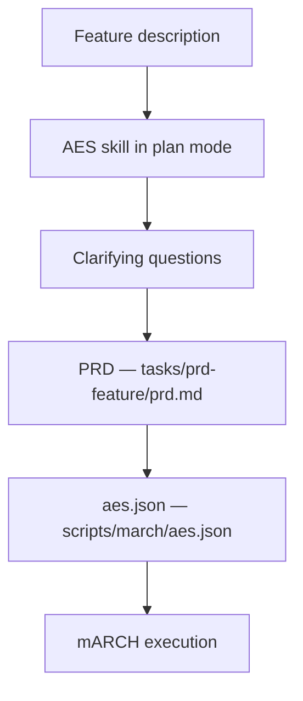
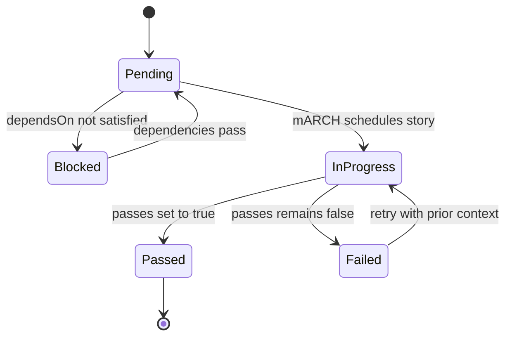

The [Red, Green, Refactor With an AI in the Loop](/agentic-development/2026/04/15/red-green-refactor-with-an-ai-in-the-loop.html) post introduced what I call an Autonomous Execution Specification (AES), and the post on [mARCH, my Agentic Release Cycle Harness](/agentic-development/2026/04/17/march-the-agentic-release-cycle-harness.html), described how the execution loop uses it. What neither post covered in depth is how the specification itself gets created in practice: the tooling, the process, and the output it produces.

## A Skill for the Red Phase

The AES is created through a Copilot skill, a short prompt file committed to the repository under `.github/skills/aes/`. When invoked in plan mode with a feature description, the skill acts as a structured guide through the red phase of the agentic cycle. It starts with clarifying questions about scope, goals, and constraints, then produces two artifacts: a human-readable product requirements document (PRD) saved as a markdown file, and the machine-consumable `aes.json` that mARCH reads at execution time.



The two-artifact design is deliberate. The PRD captures the reasoning in a form that a human can review and modify; it is the specification that answers "why was this built this way." The `aes.json` strips that reasoning into the structured fields that the executor needs: story identifiers, implementation notes, acceptance criteria, priority, complexity, and dependency links. Both exist and reference each other, but they serve different audiences.

The clarifying question phase surfaces decisions about scope boundaries, pagination strategies, error handling behavior, and edge cases that would otherwise emerge during implementation at a higher cost. By the time the PRD is written, those decisions have been made and recorded, not left for the agent to infer.

## What the aes.json Contains

A single story in `aes.json` looks like this:

```json
{
  "id": "US-002",
  "title": "Cache invalidation on price update",
  "priority": 1,
  "complexity": "standard",
  "riskLevel": "medium",
  "dependsOn": ["US-001"],
  "implementationNotes": [
    "Add invalidate_by_instrument to PriceCache in src/pricing/cache.py",
    "Trigger from PriceService.update_price after persisting",
    "Follow the existing pattern in invalidate_by_book"
  ],
  "acceptanceCriteria": [
    "Unit test: cache returns updated price after invalidation",
    "Unit test: stale entry not returned after update",
    "ruff check passes with no errors",
    "pytest passes with no failures"
  ],
  "passes": false
}
```

Each story carries a small set of fields that shape how mARCH handles it. The `complexity` and `riskLevel` fields drive model routing: trivial stories run on a faster and cheaper model, standard stories on a mid-tier model, and complex or high-risk stories escalate automatically to a more capable model. Setting `riskLevel` to `high` on a story that touches authentication or data migrations is a judgment embedded in the specification, made during the red phase when the full feature is in view, rather than a configuration decision made separately.

The `dependsOn` field encodes a dependency graph across stories. mARCH only schedules a story when every story it depends on has `passes: true`, which means a domain model story must complete before the service layer story that uses it can start. The ordering of execution is a consequence of the dependency graph rather than a fixed sequence, which matters when stories at the same priority level are unblocked and can run in parallel.

The `implementationNotes` array carries the technical specifics that prevent an agent from making assumptions: which files to touch, which patterns to follow, which edge cases to handle, and which constraints to avoid violating. The `acceptanceCriteria` array closes the loop with verifiable assertions. Every criterion is written as a test assertion, and the final criteria in every story are always the build and test commands for the stack: `ruff check passes with no errors` and `pytest passes with no failures` for Python projects, `dotnet build` and `dotnet test` for .NET. An agent that does not satisfy all criteria has not passed the story.

## What mARCH Does with It

When mARCH starts a run, it reads the `aes.json` and injects it in full into every agent session alongside the project's `COPILOT.md` operating manual. The injection happens at the start of every session, not once at the start of the run. Each session the agent receives the complete feature description, the full list of stories with their current state, and the story it is being asked to implement, regardless of how many sessions have already run.



This is the solution to the context rot problem described in the [mARCH post](/agentic-development/2026/04/17/march-the-agentic-release-cycle-harness.html): context rot occurs when an agent's prior conversation history crowds out the project context that was established early in the run, causing the agent to lose track of architectural decisions. Fresh injection at every session means the agent never loses access to the intent of the feature, even in session fifteen of a complex run.

Before the story loop starts, mARCH also generates two supporting files. `FEATURE_CONTEXT.md` groups stories by keyword similarity, identifies which data model fields are introduced, and flags which modules are touched across multiple stories, giving the agent a structural overview that is faster to orient from than reading the full specification top to bottom. `DECISIONS.md` provides a decision log with one row per story; the agent fills in the architectural decision and its rationale after each story completes, and the file accumulates across runs. An agent in a later session can read the decision log and understand why earlier stories were implemented the way they were without having access to the conversation history that produced those implementations.

## The Review Loop

After all stories have `passes: true`, mARCH runs an automated code review comparing the feature branch to main. The review runs under the most capable available model and produces findings categorized by severity: logic errors, missing edge cases, security concerns, and quality issues with file paths and line numbers attached.

Those findings feed directly back into the specification process. The runner invokes the AES skill with the review output, which produces a new PRD and a new `aes.json` treating each finding or group of related findings as a story. mARCH then runs the new specification exactly as it ran the original one: story by story, with dependency resolution, context injection, quality gates, and retry logic. The review findings become a second wave of the red-green-refactor cycle, executed with the same structure as the first.

The human review comes at the end of this second wave. By that point the branch has been implemented, reviewed, and the review findings addressed. What remains for the human is the final diff: code that was written against a specification, reviewed automatically, and corrected through a second specification. The diff is readable because the specification exists to explain it.

## Writing Specifications as Part of the Workflow

The practical consequence of having a skill for specification is that writing the AES is the starting point for any feature, not an optional step before the actual work begins. Invoking the skill takes a few minutes of conversation in plan mode; the harder work is answering the clarifying questions honestly, which requires actually thinking through what the feature does and what edge cases matter. That is the work that determines the quality of everything the executor produces.

A feature where the specification was rushed tends to surface ambiguity during the mARCH run: an agent that interprets an underspecified implementation note in a way that is technically defensible but architecturally wrong, or an acceptance criterion that passes in the happy path but says nothing about the error case. These are specification gaps that the agent had no way to fill. The skill structures the conversation in a way that makes those gaps visible before the executor runs into them, which is the same discipline that writing a failing test before implementation enforces in traditional TDD.
